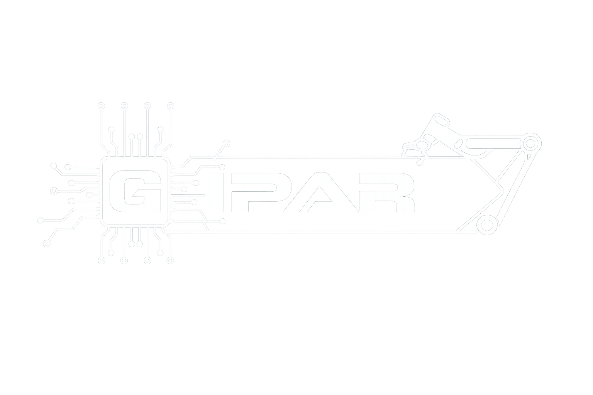

# GIPAR - Sistema de Controle de Componentes e Equipamentos

<p align="center">
  
</p>

Sistema desenvolvido para o **Grupo de Inovação e Pesquisa em Automação e Robótica (GIPAR)** do **Instituto Federal da Bahia (IFBA) - Campus Vitória da Conquista**, com o objetivo de gerenciar equipamentos, componentes eletrônicos, empréstimos, devoluções, manutenções e usuários do laboratório.

O projeto foi desenvolvido durante a 2º fase da residência tecnológica do **Programa Bolsa Futuro Digital (CEPEDI)**.

---

# Sobre o Projeto

O GIPAR é um sistema web para gerenciamento patrimonial do laboratório.

A aplicação permite controlar:

- 📦 Equipamentos
- 🔌 Componentes
- 📋 Empréstimos
- ↩️ Devoluções
- 📅 Reservas
- 🛠️ Manutenções
- 👥 Usuários
- 📊 Relatórios

Toda a aplicação utiliza uma arquitetura desacoplada, onde o Frontend consome uma API REST desenvolvida em FastAPI.

---

# Principais Funcionalidades

### 👨‍💼 Administrador

- Cadastro de usuários
- Cadastro de equipamentos
- Cadastro de categorias
- Cadastro de componentes
- Controle de manutenções
- Controle de empréstimos
- Dashboard administrativo
- Geração de relatórios

### 👨‍🔧 Estagiário

- Registrar empréstimos
- Registrar devoluções
- Visualizar equipamentos
- Dashboard

### 👨‍🏫 Professor

- Consultar equipamentos
- Consultar empréstimos
- Consultar manutenções

### 🎓 Aluno

- Visualizar catálogo
- Consultar empréstimos
- Acompanhar devoluções

## 🛠️ Tecnologias Utilizadas

## Backend

- Python 3.14
- FastAPI
- Uvicorn
- PyMySQL
- Pydantic
- JWT
- Argon2
- Passlib

## Frontend

- React
- Vite
- TailwindCSS
- React Router
- Lucide Icons

## Banco de Dados

- MySQL

## Versionamento

- Git
- GitHub

---

# Estrutura do Projeto

```
📦 cepedi-capacita04-grupo3
│
├── 📁 backend/              # API REST em FastAPI
│
├── 📁 frontend/             # Interface React + Vite
│
├── 📁 docs/                 # Documentação do projeto
│   ├── 📁 acompanhamentos/  # Relatórios e acompanhamentos
│   ├── 📁 diagramas/        # Diagramas UML e arquitetura
│   ├── 📁 manuais/          # Manual do usuário
│   └── autenticacao.md      # Fluxo de autenticação JWT
│
├── 📁 scripts/
│   ├── 📁 migracao_planilha/ # Scripts de importação de dados
│   └── backup_db.sh          # Backup do banco MySQL
│
├── .gitignore
├── LICENSE
├── commit-msg.txt
├── dependencias.txt
└── README.md
```

---

# 🚀 Como Executar o Projeto

## 1 - Clone o repositório

```bash
git clone https://github.com/Vandamelloz/cepedi-capacita04-grupo3.git
```

Entre na pasta:

```bash
cd backend
```

---

# 2 - Criando o ambiente virtual

Windows

```bash
python -m venv venv
```

Ative:

PowerShell

```powershell
.\venv\Scripts\Activate.ps1
```

Prompt CMD

```cmd
venv\Scripts\activate
```

Linux

```bash
python3 -m venv venv

source venv/bin/activate
```

---

# 3 - Instalando as dependências

```bash
pip install -r requirements.txt
```

Caso necessário:

```bash
pip install fpdf
```

---

# 4 - Configuração do Banco de Dados

O projeto utiliza MySQL.

Crie um banco chamado:

```sql
gipar_db
```

Execute o script SQL localizado em:

```
backend/banco.txt
```
---

# 5 - Configuração do arquivo `.env`

Na pasta `backend`, copie o arquivo:

```text
.env.example
```

Renomeie a cópia para:

```text
.env
```

Em seguida, preencha as informações do arquivo com as credenciais do seu ambiente (como a senha do banco de dados e, se necessário, as configurações de e-mail).

---

# ▶️ Executando o Backend

Execute:

```bash
python -m uvicorn main:app --reload
```

Se tudo estiver correto aparecerá:

```
INFO: Uvicorn running on http://127.0.0.1:8000
```

---

# ▶️ Executando o Frontend

Entre na pasta:

```bash
cd frontend
```

Instale as dependências:

```bash
npm install
```

Execute:

```bash
npm run dev
```

A aplicação provavelmente ficará disponível em:

```
http://localhost:5173/
```

---
## 👥 Perfis de Usuário

| Perfil | Permissões |
|---------|------------|
| 👨‍💼 Administrador | Controle total do sistema |
| 👨‍🏫 Professor | Consulta equipamentos e empréstimos |
| 👨‍🔧 Estagiário | Empréstimos e devoluções |
| 🎓 Aluno | Consulta catálogo e empréstimos |
---

# Funcionalidades Implementadas

- Dashboard Administrativo
- Dashboard Estagiário
- Autenticação JWT
- Controle de usuários
- Cadastro de equipamentos
- Cadastro de categorias
- Cadastro de componentes
- Controle de empréstimos
- Controle de devoluções
- Controle de reservas
- Controle de manutenção
- Histórico de movimentações
- Logs de auditoria
- Exportação PDF
- Exportação CSV
- Relatórios
- API REST

---

# 👨‍💻 Equipe de Desenvolvimento

### Backend

- Alexandro Costa Santos
- Francis Ricardo Silva Conceição
- Helen da Cruz Nascimento
- Pedro Paulo Santos Silva
- Vanderléia dos Santos Mello (Scrum Master)
- Yan Mangabeira

### Frontend

- Hiago Alves da Silva
- Isabela Sousa Sousa
- Paulo Victor Almeida de Oliveira
- Paulo Vitor Dias Soares

---
